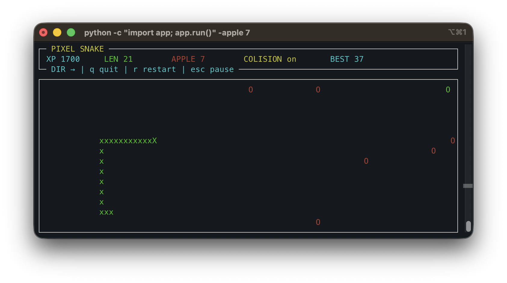

# 🐍 Snake TUI

> Snake mais dans le terminal.

<p align="center">
  
</p>

---

## 📦 Installation

### Sur MacOS

```bash
git clone https://github.com/OrAxelerator/pixel-snake-tui.git
cd pixel-snake-tui
pip install -e .
```

### Sur Linux

`pip` peut installer le jeu, mais `pipx` est recommandé.

Installation de `pipx` :

```bash
sudo apt install pipx
pipx ensurepath
```

Puis :

```bash
git clone https://github.com/OrAxelerator/pixel-snake-tui.git
cd pixel-snake-tui
pipx install .
```

### Sur Windows

```bash
git clone https://github.com/OrAxelerator/pixel-snake-tui.git
cd pixel-snake-tui
python -m pip install .
```

---

##  Lancement

```bash
snake
```

### Options

```bash
snake -apple 4
snake -no-colision
snake -apple 4 -no-colision
```

---

##  Touches

- Fleches ou `h` `j` `k` `l` : déplacer le serpent
- `esc` : pause
- `r` : relancer
- `q` : quitter

> Devrait marcher sur tous les OS, sauf peut-être Windows.

---

##  Pommes

Il existe différents types de pommes :

| Type | Effet |
|------|--------|
| 🔴 Rouge | pomme normale `+1` |
| 🟡 Jaune | pomme dorée `+2` |
| 🟢 Verte | pomme d'uranium `-1` |
| 🔵 Bleue | pomme glitchée, inverse les contrôles pendant `1s` |

---

##  Inspiration

Issu de cette vidéo :  
https://www.youtube.com/watch?v=lziU_yT0iDc

---

##  Licence

[LICENSE MIT](./LICENSE.md)
EOF